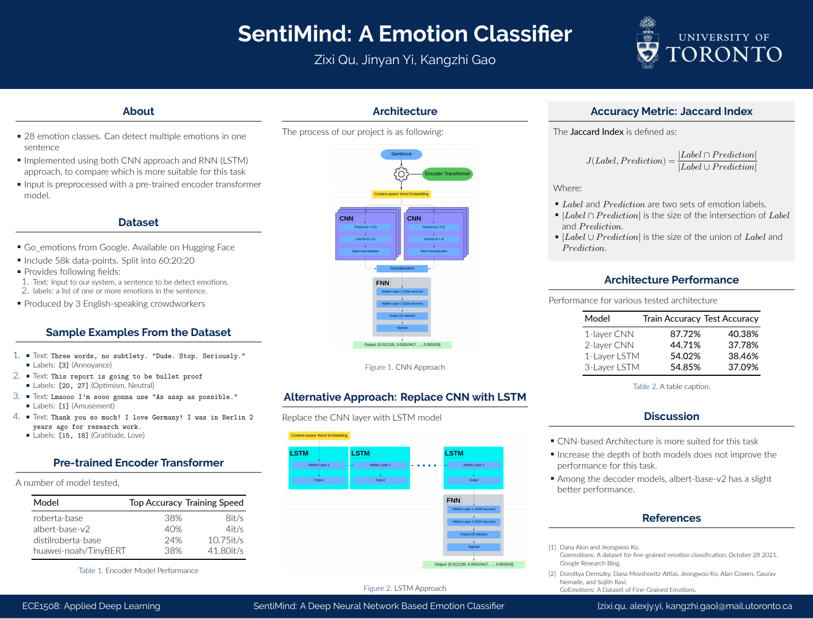

# SentiMind

## Description
This project is designed to help users understand and classify emotions from textual input.  The dataset is sourced from **[GoEmotions](https://huggingface.co/datasets/google-research-datasets/go_emotions)**, a comprehensive collection of over 50,000 labeled sentences developed by Google and Stanford. The labels are 28 emotion classes, including joy, remorse, curiosity, etc. Each sentence was annotated by three English-speaking crowdworkers to ensure high-quality emotion classification. 

**Model Architecture:**

The project delivers two distinct model implementations:

1. A **CNN-based** architecture
2. An **RNN (LSTM)-based** architecture

Comparative analysis revealed that the **CNN model outperformed** in training efficiency and demonstrated more robust generalization on unseen data, yielding more reliable predictions for new inputs.

**Evaluation & Feedback:**

Initially released as a free trial at the **University of Toronto**, the model achieved an **85% user satisfaction rate** among students, who found the emotion classifications accurate and insightful.


## Usage

To launch Gradio-based demo web application:

```bash
cd source
python UI.py
```

This will start a local server and provide a URL, where you can interact with the emotion classification demo.

## Poster




## Technologies


## Gallery

Sample model inference that demonstrate the performance of the model. Inputs are randomly picked from r/uoft comments.


