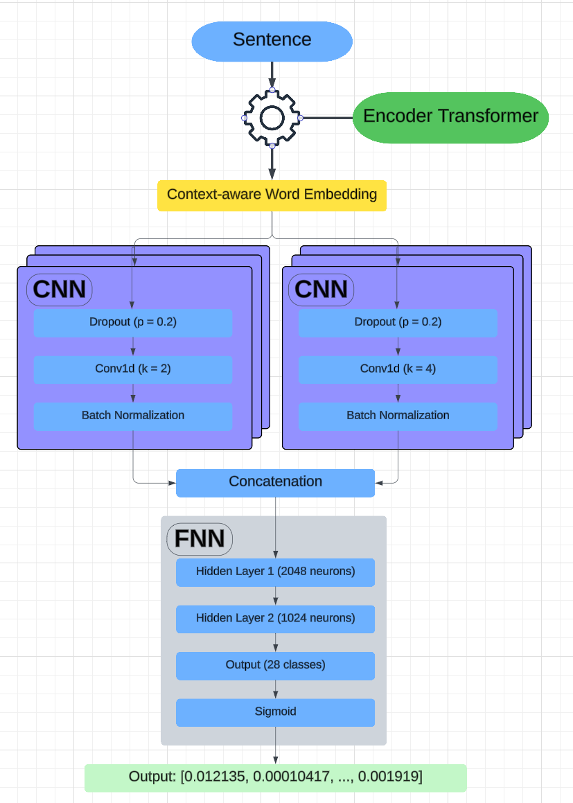
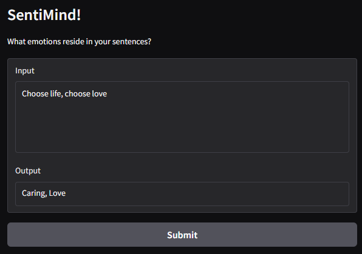
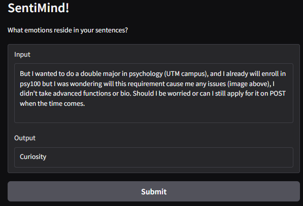
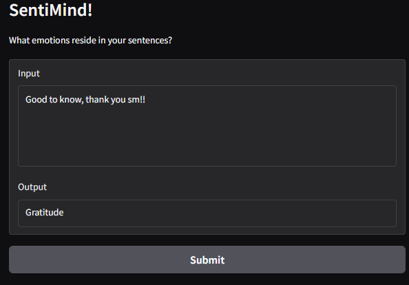

# SentiMind

## Description
This project is designed to help users understand and classify emotions from textual input.  The dataset is sourced from **[GoEmotions](https://huggingface.co/datasets/google-research-datasets/go_emotions)**, a comprehensive collection of over 50,000 labeled sentences developed by Google and Stanford. The labels are 28 emotion classes, including joy, remorse, curiosity, etc. Each sentence was annotated by three English-speaking crowdworkers to ensure high-quality emotion classification. 

**Model Architecture:**

The project delivers two distinct model implementations:

1. A **CNN-based** architecture
2. An **RNN (LSTM)-based** architecture

Comparative analysis revealed that the **CNN model outperformed** in training efficiency and demonstrated more robust generalization on unseen data, yielding more reliable predictions for new inputs.

**Evaluation & Feedback:**

Initially released as a free trial at the **University of Toronto**, the model achieved an **85% user satisfaction rate** among students, who found the emotion classifications accurate and insightful.


## Usage

To launch Gradio-based demo web application:

```bash
cd source
python UI.py
```

This will start a local server and provide a URL, where you can interact with the emotion classification demo.


## Technologies



The input sentences undergo a pre-trained encoder-based transformer network to generate context-aware word embeddings. These embeddings are processed in parallel through two CNN branches with distinct kernel sizes: a 2-word convolutional filter and a 4-word convolutional filter. Each CNN pathway incorporates standard regularization techniques including batch normalization and dropout layers to prevent overfitting. The feature maps from both convolutional branches are concatenated into a unified representation vector, which is then fed through a fully connected classification network. Notably, the output layer employs sigmoid activation instead of softmax to enable multi-label classification capability.


## Model Evaluation

The system was publicly released to University of Toronto students for real-world testing. Participants were invited to:

1. Submit arbitrary text inputs to the model
2. Review the generated emotion classifications
3. Respond with the satisfaction level of the generated result.

From over 300 collected trial responses, the model demonstrated **over 85% success rate** in accurate emotion recognition.


## Gallery

Sample model inference that demonstrate the performance of the model. Inputs are randomly picked from r/uoft comments.





